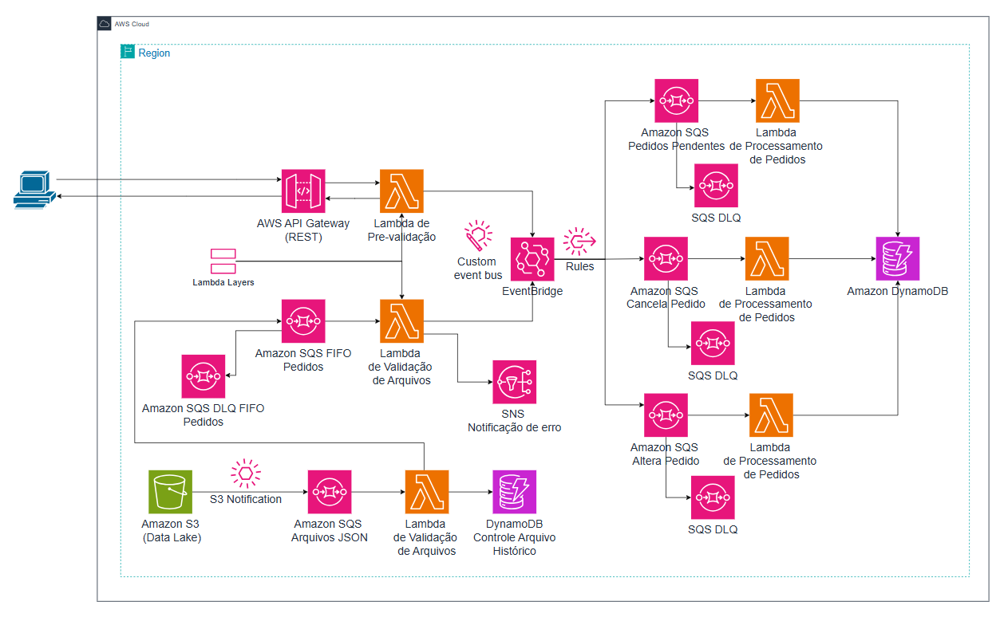

# Laboratório Serverless AWS: Entrada de Pedido pelo Data Lake
Este laboratório tem como objetivo ensinar a criação de uma arquitetura Event Driven - Event-driven Architecture (EDA) na AWS para processar pedidos de venda a partir de arquivos JSON armazenados no Amazon S3 e enviados pelo Amazon API Gateway.

O laboratório está dividido em quatro partes, organizadas em quatro arquivos que devem ser seguidos na ordem, pois cada um complementa o anterior.

---

---

A primeira parte (que se trata desse arquivo) ensina a desenvolver uma função AWS Lambda que é responsável por receber mensagens de uma fila SQS padrão com informações de eventos de S3 ao serem criados novos arquivos. A função Lambda lê o evento do S3, faz o download do arquivo, processa os pedidos e registra as informações no DynamoDB sobre os arquivos e pedidos processados para evitar indempotência. Além disso, envia os pedidos para uma fila SQS FIFO `sqs-pedidos-validos.fifo`.

A segunda parte do fluxo de processamento de pedidos cria uma função Lambda de validação que lê mensagens da fila `sqs-pedidos-validos.fifo`, valida os dados e, dependendo do resultado, envia eventos para o Amazon EventBridge ou alertas para o Amazon SNS. Também serão configurados um Event Bus com três regras de roteamento para diferentes status de pedido (Pendente, Alterar Pedido e Cancela Pedido), filas SQS FIFO de destino para cada status com suas respectivas DLQs, e serão realizados testes do fluxo via console.

Na terceira parte do fluxo, será criado um API Gateway para receber pedidos como alternativa ao envio para o Data Lake (S3). Uma função Lambda, utilizando o mesmo Layer de validação da etapa anterior, processará os pedidos recebidos, validando os dados e encaminhando os pedidos válidos para o Event Bus, que foi configurado com as regras de roteamento na etapa anterior. Em caso de falha na validação, o usuário receberá uma mensagem de erro diretamente pelo API Gateway. O fluxo será testado para garantir o roteamento correto dos pedidos válidos e o retorno apropriado de erros para entradas inválidas.

Na quarta e última parte, será desenvolvido um backend com três funções Lambda responsáveis por operar sobre os pedidos armazenados nas filas SQS. Cada função Lambda será responsável por uma operação específica: armazenar, alterar ou cancelar o pedido no DynamoDB. As funções Lambda processarão os pedidos de acordo com o padrão de Single Table Design.
