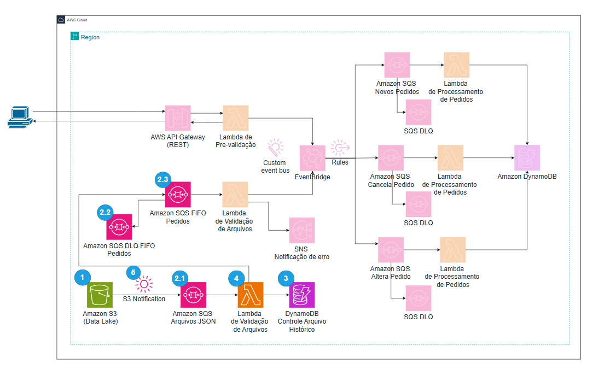

# Laboratório Serverless AWS: Entrada de Pedido pelo Data Lake

A primeira parte (que se trata desse arquivo) ensina a desenvolver uma função AWS Lambda que é responsável por receber mensagens de uma fila SQS padrão com informações de eventos de S3 ao serem criados novos arquivos. A função Lambda lê o evento do S3, faz o download do arquivo, processa os pedidos e registra as informações no DynamoDB sobre os arquivos e pedidos processados para evitar indempotência. Além disso, envia os pedidos para uma fila SQS FIFO `sqs-pedidos-validos.fifo`.

---



## **O que Você Irá Aprender nesta atividade**

- [**Etapa 1:** Criar o Bucket S3 e o Prefixo para os Pedidos](#etapa-1-criar-o-bucket-s3-e-o-prefixo-para-os-pedidos).
- [**Etapa 2:** Criar as Filas SQS](#etapa-2-criar-as-filas-sqs)
  - [**2.1** Criar fila SQS Standard para o S3](#21-fila-standard-sqs-pedidos-json)
  - [**2.2** Criar fila FIFO dlq para armazena pedidos que não puderam ser processados após o número máximo de tentativas.](#22-fila-dlq-fifo-sqs-pedidos-dlqfifo)
  - [**2.3** Criar fila FIFO para armazena pedidos de forma individual](#23-fila-fifo-sqs-pedidos-validosfifo)
- [**Etapa 3:** Criar Tabela no DynamoDB para controle de indempotência de pedidos e arquivos JSON.](#etapa-3-criar-tabela-no-dynamodb)
- [**Etapa 4:** Lambda de Extração de pedido e Controle de Duplicidade](#etapa-4-lambda-de-extração-de-pedido-e-controle-de-duplicidade)
- [**Etapa 5:** Criar o Triger para Lambda SQS](#etapa-5-criar-em-s3-notification)
- [**Etapa 6:** Testes completo do fluxo](#etapa-6-teste-do-fluxo-completo)

---

### **Pré-requisitos**

- **Conta AWS ativa** com permissões para criar recursos (S3, SQS, SNS, Lambda, EventBridge e IAM).
- **Acesso ao console da AWS** via navegador web.


### Fluxo de Trabalho:
- O Lambda é acionado quando a fila SQS padrão recebe uma notificação de evento S3.
- O Lambda lê o arquivo do S3 e processa os pedidos.
- Cada pedido é enviado para a fila SQS FIFO de destino.
- O Lambda registra os pedidos no DynamoDB com detalhes básicos e evita duplicações.

---

## **Etapa 1**: Criar o Bucket S3 e o Prefixo para os Pedidos

1. **Acessar o Amazon S3:**

   - Faça login na console da AWS.
   - No menu de serviços, selecione **S3** (pode usar a barra de pesquisa).
   - **AWS Region:** Certifique-se de estar na região em que pretende trabalhar. (por exemplo, **us-east-1**).

2. **Criar um Bucket:**

   - Clique em **Create bucket**.
   - **Bucket name:** `translogistica-pedidos` (os nomes de bucket devem ser exclusivos globalmente; se esse nome não estiver disponível, escolha outro nome exclusivo, como `translogistica-pedidos-seu-nome`).
   - Mantenha as demais configurações padrão.
   - Clique em **Create bucket**.

3. **Criar o Prefixo (Pasta) "novos-pedidos/":**

   - Clique no nome do bucket criado para acessá-lo.
   - Clique em **Create folder**.
   - **Folder name:** `novos-pedidos`
   - Clique em **Create folder**.

---

## **Etapa 2: Criar as Filas SQS**

### **2.1. Acessar o Amazon S3:**

   - Faça login na console da AWS.
   - No menu de serviços, selecione **SQS** (pode usar a barra de pesquisa).
   - **AWS Region:** Certifique-se de estar na região em que pretende trabalhar. (por exemplo, **us-east-1**).

### **2.2. Fila Standard: `sqs-pedidos-json`**
Esta fila é utilizada para armazenar a notificação de novos arquivos JSON carregados no bucket S3.

2. Clique em **Create queue**.
3. Escolha **Standard Queue**.
4. **Queue Name:** `sqs-pedidos-json`.
5. Na seção *Access policy* clique em **Advanced**

Cole o seguinte código, substituindo `<YOUR_REGION>` pela sua região (por exemplo, `us-east-1` para **N.Virginia** ou `us-east-2` para **Ohio**), `<BUCKET_NAME>` pelo nome do backup criado na etapa 1 ex: `translogistica-pedidos-seu-nome`  e `<YOUR_ACCOUNT_ID>` pelo ID da sua conta AWS (este pode ser encontrado no canto superior direito da console da AWS; clique no nome do usuário e o ID da conta aparecerá como 'Account ID: 123456789012'; é um número de 12 dígitos):
```json
 {
  "Version": "2012-10-17",
  "Id": "__default_policy_ID",
  "Statement": [
    {
      "Sid": "__owner_statement",
      "Effect": "Allow",
      "Principal": {
        "AWS": "YOUR_ACCOUNT_ID"
      },
      "Action": [
        "SQS:*"
      ],
      "Resource": "arn:aws:sqs:YOUR_REGION:YOUR_ACCOUNT_ID:sqs-pedidos-json"
    },
    {
      "Sid": "AllowS3BucketToSendMessages",
      "Effect": "Allow",
      "Principal": "*",
      "Action": "SQS:SendMessage",
      "Resource": "arn:aws:sqs:YOUR_REGION:YOUR_ACCOUNT_ID:sqs-pedidos-json",
      "Condition": {
        "ArnEquals": {
          "aws:SourceArn": "arn:aws:s3:::BUCKET_NAME"
        }
      }
    }
  ]
}
```

6. Clique em **Create Queue**.


### **2.3. Fila DLQ FIFO: `sqs-pedidos-dlq.fifo`**
Esta fila FIFO armazena pedidos que não puderam ser processados após o número máximo de tentativas.

1. Clique em **Queues** no menu da esquerda. (obs: caso não esteja aparecendo o nome clica no icone *com 3 traços* no canto superior esquerdo)
2. 2. Clique em **Create queue**.
3. Escolha **FIFO** 
4. **Queue Name:** `sqs-pedidos-dlq.fifo`.
5. Habilite **Content-based deduplication**.

### **2.3. Fila FIFO: `sqs-pedidos-validos.fifo`**
Esta fila FIFO recebe pedidos individuais extraídos do arquivo JSON.

1. Clique em **Queues** no menu da esquerda.
2. Clique em **Create queue**.
3. Escolha **FIFO**.
3. **Queue Name:** `sqs-pedidos-validos.fifo`.
4. Marque **Content-based deduplication** para evitar envios duplicados.
5. Configure uma DLQ FIFO para tratar mensagens que falham:
   - Em **Dead-letter queue:** Clica em **Enabled**
   - **Choose queue:** `sqs-pedidos-dlq.fifo`.
   - **MaxReceiveCount:** 3 (número máximo de tentativas).
6. Clique em **Create Queue**.


## **Etapa 3: Criar Tabela no DynamoDB**

1. **Acessar o Amazon DynamoDB:**
   - No menu de serviços, selecione **DynamoDB**.

2. **Criar uma nova tabela:**
   - Clique em **Create Table**.

3. **Configurar a tabela:**
   - **Table Name:** `OrdersTable`.
   - **Partition Key:** `PK` (Tipo: `String`).
   - **Sort Key:** `SK` (Tipo: `String`).

4. **Finalizar a criação:**
   - Clique em **Create Table**.

---

## **Etapa 4: Lambda de Extração de pedido e Controle de Duplicidade**
Esta função lê o arquivo JSON do S3, registra os pedidos no DynamoDB para evitar duplicação e envia os pedidos para a fila FIFO.

### 4.1. Acessar o AWS Lambda
1. No menu de serviços da AWS, procure por **Lambda**.
2. Clique em **Create function**.

### 4.2. Criar a Função
1. **Function name:** `extract-and-send-orders`
2. **Runtime:** escolha **Python 3.13** (ou versão mais recente disponível).
3. Clique em **Create function**.

### 4.3. Inserir o Código-Fonte
Na página da função, role até **Code source**:

1. Apague o conteúdo padrão do editor.
2. Cole o seguinte código:

**Código python:**
~~~python
import boto3, json, os, logging
from datetime import datetime
from decimal import Decimal

def decimal_default(obj):
    if isinstance(obj, (float, Decimal)):
        return str(obj)  # Convertendo para string para evitar erro de Decimal no JSON
    raise TypeError(f"Tipo não suportado: {type(obj)} - Valor: {obj}")

logger = logging.getLogger()
logger.setLevel(logging.INFO)

dynamo_client = boto3.resource('dynamodb')
sqs_client = boto3.client('sqs')
s3_client = boto3.client('s3')

DYNAMO_TABLE_NAME = os.getenv('DYNAMO_TABLE_NAME')
SQS_FIFO_URL = os.getenv('SQS_FIFO_URL')

def lambda_handler(event, context):
    for record in event['Records']:
        try:
            # Extrair a mensagem da fila SQS com evento S3
            body = json.loads(record['body'])
            s3_event = body.get('Records', [])[0] if 'Records' in body else None
            if not s3_event or 's3' not in s3_event:
                logger.error("Mensagem SQS não contém informações S3 válidas: %s", body)
                continue

            bucket = s3_event['s3']['bucket']['name']
            key = s3_event['s3']['object']['key']

            logger.info(f"Iniciando processamento do arquivo: {key}")

            # Ler o arquivo do S3
            response = s3_client.get_object(Bucket=bucket, Key=key)
            orders = json.loads(response['Body'].read().decode('utf-8'), parse_float=Decimal)
            logger.debug(f"Conteúdo do arquivo: {orders}")

            if check_file_processed(key):
                logger.info(f"Arquivo {key} já processado.")
                continue

            # Processar os pedidos e enviar para a fila
            successful_orders = []
            for order in orders:
                logger.debug(f"Processando pedido: {order['order_id']}")
                if should_process_order(order):
                    logger.info(f"Pedido elegível para processamento: {order['order_id']} com status {order['order_status']}")
                    if send_to_fifo(order):
                        successful_orders.append(order)
                else:
                    logger.warning(f"Pedido {order['order_id']} ignorado devido ao status: {order['order_status']}")

            # Registrar o arquivo no DynamoDB apenas se houver pedidos enviados
            if successful_orders:
                register_file_in_dynamodb(key)
                register_orders_in_dynamodb(successful_orders, key)

        except KeyError as e:
            logger.error(f"Erro na estrutura da mensagem SQS: campo ausente {str(e)}", exc_info=True)
        except Exception as e:
            logger.error(f"Erro ao processar a mensagem da fila SQS: {str(e)}", exc_info=True)

    return {"statusCode": 200, "body": "Processamento concluído com sucesso"}

def check_file_processed(file_name):
    table = dynamo_client.Table(DYNAMO_TABLE_NAME)
    response = table.get_item(Key={"PK": f"FILE#{file_name}", "SK": "SUMMARY"})
    is_processed = 'Item' in response
    logger.debug(f"Arquivo {file_name} já registrado? {is_processed}")
    return is_processed

def register_file_in_dynamodb(file_name):
    logger.info(f"Registrando arquivo {file_name} no DynamoDB.")
    table = dynamo_client.Table(DYNAMO_TABLE_NAME)
    table.put_item(Item={"PK": f"FILE#{file_name}", "SK": "SUMMARY", "ProcessedAt": datetime.utcnow().isoformat()})

def register_orders_in_dynamodb(orders, file_name):
    table = dynamo_client.Table(DYNAMO_TABLE_NAME)
    with table.batch_writer() as batch:
        for order in orders:
            order_id = order['order_id']
            status = order['order_status']
            try:
                logger.debug(f"Registrando pedido {order_id} com status {status}")
                batch.put_item(Item={
                    "PK": f"ORDER#{order_id}",
                    "SK": f"STATUS#{status}",
                    "OrderStatus": status,
                    "ArquivoOrigem": file_name,
                    "ProcessedAt": datetime.utcnow().isoformat(),
                    "CompanyName": order['company']['name']
                })
            except Exception as e:
                logger.error(f"Erro ao registrar pedido {order_id} no DynamoDB: {str(e)}")

def send_to_fifo(order):
    try:
        logger.debug(f"Serializando pedido {order['order_id']} para envio.")
        order_message = json.dumps(order, default=decimal_default)

        params = {
            "QueueUrl": SQS_FIFO_URL,
            "MessageBody": order_message,
            "MessageGroupId": "orders-group"
        }

        # Adicionar MessageDeduplicationId sempre para garantir unicidade
        deduplication_id = str(hash(f"{order['order_id']}-{order['order_status']}-{datetime.utcnow().isoformat()}"))
        params["MessageDeduplicationId"] = deduplication_id
        logger.debug(f"Usando MessageDeduplicationId: {deduplication_id}")

        sqs_client.send_message(**params)
        logger.info(f"Pedido {order['order_id']} enviado com sucesso para a fila.")
        return True
    except Exception as e:
        logger.error(f"Erro ao enviar pedido {order['order_id']} para a fila: {str(e)}")
        return False

def should_process_order(order):
    status = order['order_status']
    logger.debug(f"Verificando status do pedido {order['order_id']}: {status}")
    if status in ["PedidoCancelado", "PedidoAlterado"]:
        return True
    elif status in ["Pendente", "PedidoNovo"]:
        table = dynamo_client.Table(DYNAMO_TABLE_NAME)
        response = table.get_item(Key={"PK": f"ORDER#{order['order_id']}", "SK": f"STATUS#{status}"})
        exists = 'Item' in response
        logger.debug(f"Pedido {order['order_id']} com status {status} já existe? {exists}")
        return not exists  # Só processa se não existir
    return False
~~~

3. Clique em **Deploy** para salvar as alterações.

### 4.4. Adicionar Variáveis de Ambiente
1. No menu superior clique em **Configuration** e após, no menu da esquerda clique em **Environment variables**.
2. Clique em **Edit** e depois em **Add environment variable**:
   - **Key**: `DYNAMO_TABLE_NAME`
   - **Value**: `OrdersTable` (ou o nome da tabela do DynamoDB)
3. Clique novamento em **Add environment variable**:
   - **Key**: `SQS_FIFO_URL`
   - **Value**: A URL do SQS **sqs-pedidos-validos.fifo** (por exemplo, `(https://sqs.us-east-1.amazonaws.com/<account_id>/sqs-pedidos-validos.fifo)`) para pegar a URL acesse o AWS SQS Console, clique no nome da fila **sqs-pedidos-validos.fifo**, e a URL estará visível nos detalhes da fila.
4. Clique em **Save**.

### 4.5. Ajustar Timeout e Memória

1. Ainda em **Configuration** > **General configuration**.
3. Clique em **Edit**
4. Ajuste **Memory** para `256` MB.
5. Ajuste **Timeout** para `0` minutos e `30` segundos 
6. Clique em **Save**.

---


### 4.6. **Política IAM (JSON)**
Adicione a seguinte política ao role da Lambda de Extração:

1. No painel da função Lambda, clique em **Configuration** > **Permissions**.
2. Clique no nome da role **role name** atribuída à função. Que será parecido com `extract-and-send-orders-role-xxxxxx`
3. Clique em **Add permissions** > **Create inline policy**.
4. Selecione a aba **JSON** e cole o seguinte código, substituindo `<YOUR_REGION>` pela sua região (por exemplo, `us-east-1` para **N.Virginia** ou `us-east-2` para **Ohio**), `<BUCKET_NAME>` pelo nome do backup criado na etapa 1 ex: `translogistica-pedidos-seu-nome`  e  `<YOUR_ACCOUNT_ID>` pelo ID da sua conta AWS (este pode ser encontrado no canto superior direito da console da AWS; clique no nome do usuário e o ID da conta aparecerá como 'Account ID: 123456789012'; é um número de 12 dígitos):

~~~json
{
  "Version": "2012-10-17",
  "Statement": [
    {
      "Effect": "Allow",
      "Action": ["s3:GetObject"],
      "Resource": "arn:aws:s3:::BUCKET_NAME/*"
    },
    {
      "Effect": "Allow",
      "Action": ["dynamodb:PutItem", "dynamodb:GetItem", "dynamodb:BatchWriteItem"],
      "Resource": "arn:aws:dynamodb:YOUR_REGION:YOUR_ACCOUNT_ID:table/OrdersTable"
    },
    {
      "Effect": "Allow",
      "Action": "sqs:SendMessage",
      "Resource": "arn:aws:sqs:YOUR_REGION:YOUR_ACCOUNT_ID:sqs-pedidos-validos.fifo"
    },
		 {
      "Effect": "Allow",
      "Action": [
        "sqs:ReceiveMessage",
        "sqs:DeleteMessage",
        "sqs:GetQueueAttributes"
      ],
      "Resource": "arn:aws:sqs:YOUR_REGION:YOUR_ACCOUNT_ID:sqs-pedidos-json"
    }
  ]
}
~~~


5. Clique em **Next**.
6. Em **Policy name** digite `Extractorders`
7. Clique em **Create policy**.

**Nota:** Certifique-se de substituir `<YOUR_REGION>` e `<YOUR_ACCOUNT_ID>` pelos valores corretos.


### 4.6. **Adicionar um trigger para A lambda**

1. Na parte de cima clique em **+ Add trigger**
2. Em **Trigger configuration** Selecione `SQS`
3. Em **SQS queue** selecione `sqs-pedidos-json`
4. Decendo a tela até o final clique em `Add`

---

## **Etapa 5: Criar em S3 Notification**


1. **Acessar o Amazon S3:**

   - No menu de serviços, selecione **S3** (pode usar a barra de pesquisa).
   - **AWS Region:** Certifique-se de estar na região em que pretende trabalhar. (por exemplo, **us-east-1**).
   - No menu da esquerda Clique em **General purpose buckets**
   - Na lista de buckets, clique no nome do bucket que você criou na **etapa 1** ex: `translogistica-pedidos-seu-nome`
   - No painel de detalhes do bucket, selecione a aba "Properties" (Propriedades).

2. **Criar uma Notificação de Evento**

   - Role para baixo até a seção "Event Notifications".
   - Clique em "Create event notification".
   - Em **Event name** digite `pedidos`
   - Em **Prefix** digite  `novos-pedidos/`
   - Em **Suffix** digite `.json`
   - Selecione a opção **All object create events**
   - Descendo a tela em **Destination** selecione **SQS queue**
   - Em **SQS queue** selecione `sqs-pedidos-json`
   - 


## **Etapa 6: Teste do Fluxo Completo**
Nesta etapa, você irá testar todo o fluxo desde o envio de arquivos JSON ao bucket S3 até o processamento pelo Lambda, inserção no DynamoDB e envio para a fila SQS FIFO.

### **6.1. Fazer o Download dos Arquivos de Teste**

1. Acesse o repositório do GitHub com os arquivos de pedidos em formato .json.
2. Faça o download individual dos arquivos .json diretamente para a sua area de trabalho

## **6.2. Enviar Arquivo(s) para o Bucket S3**

1. Acesse o Amazon S3 no console da AWS.
2. No menu de serviços, clique em S3.
3. Na lista de buckets, clique no nome do bucket criado anteriormente (translogistica-pedidos-seu-nome).
4. Clique na pasta novos-pedidos/.
5. Clique em Upload:
6. Clique em Add files e selecione um ou mais arquivos .json de pedidos baixados.
7. Clique em Upload.

## **6.3. Verificar o Processamento**

1. Após o upload, o evento deve acionar automaticamente a função Lambda.
2. Acesse o Amazon CloudWatch Logs:
3. No console AWS, procure por CloudWatch.
4. Clique em Logs e selecione o log group da função Lambda extract-and-send-orders.
5. Verifique os logs para confirmar o processamento dos pedidos.

## **6.4. Verificar Inserção no DynamoDB**

1. Acesse o DynamoDB no console da AWS.
2. Clique em Tables e selecione a tabela OrdersTable.
3. Clique em Explore table items e verifique se os pedidos foram inseridos com os 4. detalhes corretos (como order_id, order_status, e ProcessedAt).

## **6.5. Verificar Mensagens na Fila FIFO**

1. Acesse o Amazon SQS no console da AWS.
2. Clique na fila sqs-pedidos-validos.fifo.
3. Clique em Send and receive messages.
4. Clique em Poll for messages para verificar se os pedidos estão presentes na fila.
