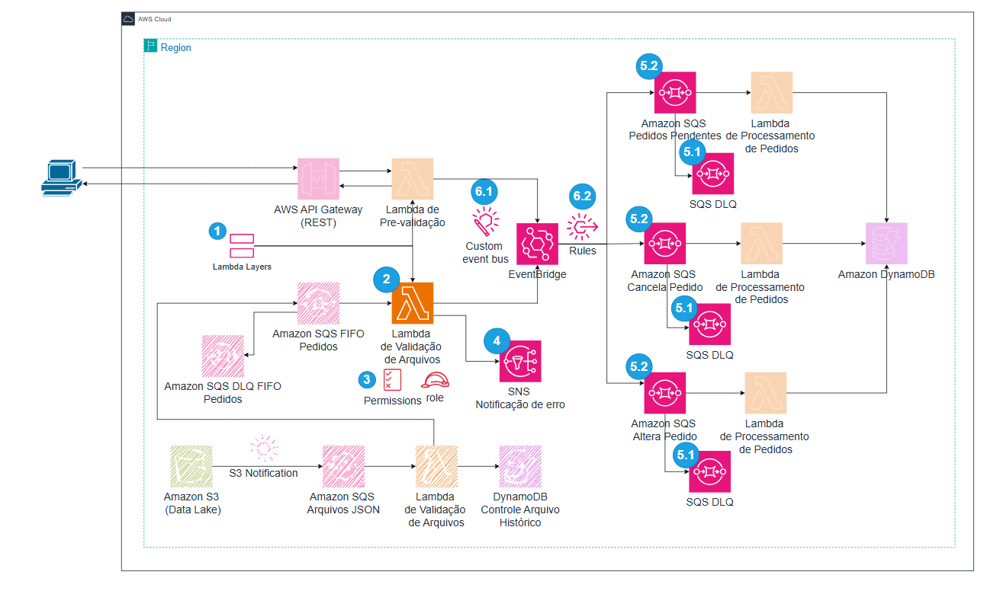

# **Segunda Parte: Validação e Roteamento de Pedidos** 

Este laboratório é a **segunda parte** do fluxo de processamento de pedidos. Supondo que já exista uma Lambda anterior que insere pedidos em uma fila SQS FIFO (chamada `sqs-pedidos-validos.fifo`), agora vamos:



## **O que Você Irá Aprender nesta atividade**

- [**Etapa 1:** Criar a Layer de Validação](#etapa-1-criar-a-layer-de-valida%C3%A7%C3%A3o).
- [**Etapa 2:** Criar a Lambda de Validação e Envio](#etapa-2-criar-a-lambda-de-valida%C3%A7%C3%A3o-e-envio)
- [**Etapa 3:** Permissões IAM da Lambda.](#etapa-3-permiss%C3%B5es-iam-da-lambda)
- [**Etapa 4:** Criar o SNS para Notificações.](#etapa-4-criar-o-sns-para-notifica%C3%A7%C3%B5es)
- [**Etapa 5:** Criar Filas SQS de Destino e DLQs](#etapa-5-criar-filas-sqs-de-destino-e-dlqs)
  - [**5.1** Criar a Fila SQS Dead Letter Queue (DLQ)](51-criar-a-fila-sqs-dead-letter-queue-dlq)
  - [**5.2** Criar a Fila SQS e associar a (DLQ).](52-criar-a-fila-sqs-e-associar-a-dlq)
- [**Etapa 6:** Criar o EventBridge Bus e Regras.](#etapa-6-criar-o-eventbridge-bus-e-regras)
  - [**6.1** Criar um Event Bus)](#61-criar-um-event-bus)
  - [**6.2** Criar as Regras de Roteamento.](#62-criar-3-regras-de-roteamento)
- [**Etapa 7:** Teste Manual no Console (Lambda)](#etapa-7-teste-manual-no-console-lambda)
- [**Etapa 8:** Validar o Fluxo Completo](#etapa-8-validar-o-fluxo-completo)

---

### **Pré-requisitos**

- **Conta AWS ativa** com permissões para criar recursos (S3, SQS, SNS, Lambda, EventBridge e IAM).
- **Acesso ao console da AWS** via navegador web.


### Fluxo de Trabalho:
- O Lambda é acionado quando a fila SQS padrão recebe uma notificação de evento S3.
- O Lambda lê o arquivo do S3 e processa os pedidos.
- Cada pedido é enviado para a fila SQS FIFO de destino.
- O Lambda registra os pedidos no DynamoDB com detalhes básicos e evita duplicações.


---

## **Etapa 1: Criar a Layer de Validação**
E Layer é uma camada de código que pode ser reaproveitado para outras Lambdas
OBS: abaixa está o passo a passo de como criar o arquivo para usar no Layer, porem temos o arquivo pronto no repositório chamodo **python.zip**, faça o download e vá direto ao tópico **1.2. Criar o Layer**.

### **1.1. Código da Layer (`order_validation_layer.py`)**
Esta layer contém a função responsável por validar os campos obrigatórios do pedido.

1. Copie o código abaixo e crie um arquivo com o nome `order_validation_layer.py`
~~~python
def validate_order(order):
    required_fields = ["order_id", "customer", "items", "payment", "company", "order_status"]
    for field in required_fields:
        if field not in order:
            return False
    return order["order_status"] in ["PedidoNovo", "PedidoAlterado", "PedidoCancelado"]
~~~

2. Crie a pasta `python` e mova `order_validation_layer.py` para dentro.
3. Zip a pasta `python`com o arquivo `order_validation_layer.py` :
~~~bash
zip -r validation_layer.zip python/
~~~

### **1.2. Criar o Layer**
1. Acesse **AWS Lambda > Layers** > **Create layer**.
2. Em **Name** digite `order-validation-layer`
4. Clique em upload e selecine o arquivo `python.zip`
5. Em **Compatible runtimes** selecione `Python 3.13`.
6. Clique em **Create**

---

## **Etapa 2 Criar a Lambda de Validação e Envio**

### 2.1. Acessar o AWS Lambda
1. No menu de serviços da AWS, procure por **Lambda**.
2. Clique em **Create function**.

### 2.2. Criar a Função
1. **Function name:** `validation-and-send-lambda`
2. **Runtime:** escolha **Python 3.13** (ou versão mais recente disponível).
3. Clique em **Create function**.

### 2.3. Inserir o Código-Fonte
Na página da função, role até **Code source**:

1. Apague o conteúdo padrão do editor.
2. Cole o seguinte código:

```python
import boto3
import json
import os
import logging

# Importa a função de validação do Layer (ajuste para o nome correto do seu arquivo/módulo)
from order_validation_layer import validate_order 

logger = logging.getLogger()
logger.setLevel(logging.INFO)

eventbridge_client = boto3.client('events')
sns_client = boto3.client('sns')

EVENT_BUS_NAME = os.getenv('EVENT_BUS_NAME')  # ex: 'event-bus-pedidos'
SNS_TOPIC_ARN = os.getenv('SNS_TOPIC_ARN')   # ex: 'arn:aws:sns:us-east-1:123456789012:sns-notificacoes-erros'

def lambda_handler(event, context):
    """
    Lê pedidos de uma fila SQS (evento disparado pelo SQS),
    valida cada pedido e envia para EventBridge ou SNS (caso inválido).
    """
    for record in event['Records']:
        try:
            body = json.loads(record['body'])
            logger.info(f"Validando pedido: {body.get('order_id', 'sem-id')}")

            if validate_order(body):
                logger.info(f"Pedido válido: {body['order_id']} com status {body['order_status']}")
                send_to_eventbridge(body)
            else:
                logger.warning(f"Pedido inválido: {body['order_id']}. Enviando alerta para SNS.")
                send_to_sns_alert(body, "Pedido inválido")

        except Exception as e:
            logger.error(f"Erro ao processar pedido {body.get('order_id', 'desconhecido')}: {str(e)}", exc_info=True)

def send_to_eventbridge(order):
    """
    Envia o pedido validado ao EventBridge, que irá rotear conforme o order_status.
    """
    try:
        event = {
            "Source": "socket-entregas.orders",
            "DetailType": "OrderEvent",
            "Detail": json.dumps(order),
            "EventBusName": EVENT_BUS_NAME
        }
        eventbridge_client.put_events(Entries=[event])
        logger.info(f"Pedido {order['order_id']} enviado ao EventBridge com status {order['order_status']}")
    except Exception as e:
        logger.error(f"Erro ao enviar pedido {order['order_id']} para EventBridge: {str(e)}")

def send_to_sns_alert(order, message):
    """
    Envia um alerta para o SNS quando o pedido é inválido.
    """
    try:
        alert_message = {
            "order_id": order.get('order_id'),
            "status": order.get('order_status'),
            "message": message
        }
        sns_client.publish(
            TopicArn=SNS_TOPIC_ARN,
            Message=json.dumps(alert_message),
            Subject="Alerta de Pedido com Problema"
        )
        logger.info(f"Alerta enviado para SNS para o pedido {order['order_id']}")
    except Exception as e:
        logger.error(f"Erro ao enviar alerta SNS: {str(e)}")
```

3. Clique em **Deploy** para salvar as alterações.

### 2.4. Adicionar Variáveis de Ambiente
1. Vá em **Configuration** > **Environment variables**.
2. Clique em **Edit** e depois em **Add environment variable**:
   - **Key**: `EVENT_BUS_NAME`
   - **Value**: `event-bus-pedidos` (ou o nome do seu Event Bus)
3. Repita para:
   - **Key**: `SNS_TOPIC_ARN`
   - **Value**: ARN do seu tópico SNS (por exemplo, `arn:aws:sns:us-east-1:123456789012:sns-notificacoes-erros`)
4. Clique em **Save**.

### 2.5. Ajustar Timeout (Opcional)
1. Ainda em **Configuration** > **General configuration**.
2. Clique em **Edit** e ajuste **Timeout** (ex: 30 s).
3. Clique em **Save**.

### 2.6. Configurar Layers

1. Clique em **Code** (menu horizontal)
2. No final da tela, na seção *Layers* clique em **Add layer**
3. Selecione **Custom layers**
4. Selecione **order-validation-layer**
5. Version **1** ou a mais recente

   
### 3.7. **Adicionar um trigger para A lambda**

1. Na parte de cima clique em **+ Add trigger**
2. Em **Trigger configuration** Selecione `SQS`
3. Em **SQS queue** selecione `sqs-pedidos-validos.fifo`
4. Decendo a tela até o final clique em `Add`

---

## **Etapa 3: Permissões IAM da Lambda**

### 3.1. Acessar a Role
1. Na página da função Lambda, vá em **Configuration** > **Permissions**.
2. Clique no nome da role (algo como `validation-and-send-lambda-role-xyz`), abrindo o console do IAM.
   


     - Na página da role IAM, clique novamente em **Add permissions**.

     - Escolha **Create inline policy**.

### 3.2. Adicionar Política Inline para SQS (invocada)
Para que a Lambda possa receber mensagens da fila, ela normalmente só precisa de permissão pass-through do SQS. Se for **SQS como trigger**, a permissão principal é dada pelo serviço. Porém, caso seja necessário explicitamente (por exemplo, a Lambda possa deletar mensagens, etc.)

   - Na página da role IAM, clique novamente em **Add permissions**.

   - Escolha **Create inline policy**.

   - **Definir a Política:**

   - Selecione a aba **JSON** e cole o seguinte código, substituindo `<YOUR_REGION>` pela sua região (por exemplo, `us-east-1` para **N.Virginia** ou `us-east-1` para **Ohio**) e `<YOUR_ACCOUNT_ID>` pelo ID da sua conta AWS (este pode ser encontrado no canto superior direito da console da AWS; clique no nome do usuário e o ID da conta aparecerá como 'Account ID: 123456789012'; é um número de 12 dígitos):

```json
{
  "Version": "2012-10-17",
  "Statement": [
    {
      "Effect": "Allow",
      "Action": [
        "sqs:ReceiveMessage",
        "sqs:DeleteMessage",
        "sqs:GetQueueAttributes"
      ],
      "Resource": "arn:aws:sqs:YOUR_REGION:YOUR_ACCOUNT_ID:sqs-pedidos-validos.fifo"
    }
  ]
}
```
*(Novamente, ajuste Região e o id da conta.)*

   - Clique em **Next**.

   - Em **Policy name** digite `LambdaSQSPolicy`

   - Clique em **Create policy**.


### 3.3. Adicionar Política para EventBridge

   - Incluia mais uma Política
     
   - Na página da role IAM, clique novamente em **Add permissions**.
     
   - Escolha **Create inline policy**.
     
   - Selecione a aba **JSON** e cole o seguinte código
     
```json
{
  "Version": "2012-10-17",
  "Statement": [
    {
      "Effect": "Allow",
      "Action": "events:PutEvents",
      "Resource": "arn:aws:events:YOUR_REGION:YOUR_ACCOUNT_ID:event-bus/event-bus-pedidos"
    }
  ]
}
```
*(Novamente, ajuste Região, Conta e nome do Event Bus.)*

   - Clique em **Next**.

   - Em **Policy name** digite `LambdaEventBridgePolicy`

   - Clique em **Create policy**.


### 3.4. Adicionar Política para SNS

   - Incluia mais uma Política
     
   - Na página da role IAM, clique novamente em **Add permissions**.
     
   - Escolha **Create inline policy**.
     
   - Selecione a aba **JSON** e cole o seguinte código

```json
{
  "Version": "2012-10-17",
  "Statement": [
    {
      "Effect": "Allow",
      "Action": "sns:Publish",
      "Resource": "arn:aws:sns:<YOUR_REGION>:<YOUR_ACCOUNT_ID>:sns-notificacoes-erros"
    }
  ]
}
```
Clique em **Review**, dê um nome como `LambdaSNSPolicy`, e crie.

---

## **Etapa 4: Criar o SNS para Notificações**

### 4.1. Criar o Tópico SNS


1. Acesse o Amazon SNS:
   - No console da AWS, vá para Services > Simple Notification Service (SNS).
   - Clique em Topics.
     
2. Criar um Tópico:

   - Clique em Create topic.
   - Type: Selecione Standard.
   - Name: Digite `sns-notificacoes-erros`
   - Deixe as outras configurações como padrão.
   - Clique em **Create topic**.

### 4.2. Criar uma Assinatura (Opcional)
Para receber notificações por e-mail ou SMS, você pode criar uma assinatura no tópico SNS:

1. Criar Subscription:
   - No painel do tópico sns-notificacoes-erros, clique em **Create subscription**.

2. Configurar a Assinatura:
   - Protocol: Selecione o método de entrega desejado:
      - Email: para notificações via e-mail.
      - SMS: para notificações via mensagem de texto.
      - HTTP/HTTPS: para envio de notificações para uma URL (caso seu sistema aceite requisições HTTP).
   - Endpoint: Digite o endereço de e-mail, número de telefone, ou URL de endpoint.
     
3. Confirmar a Assinatura:
   - Se você selecionou Email, verifique sua caixa de entrada.
   - Clique no link de confirmação enviado pelo Amazon SNS para ativar a assinatura.

---

Exemplo de Uso no Código Lambda
   - O ARN do tópico SNS será necessário na variável de ambiente SNS_TOPIC_ARN.
   - O ARN do tópico SNS está localizado nos detalhes do tópico, no formato:
   ```
   arn:aws:sns:us-east-1:<YOUR_ACCOUNT_ID>:sns-notificacoes-erros
   ```

## **Etapa 5: Criar Filas SQS de Destino e DLQs**
Cada tipo de status do pedido precisa de sua **fila FIFO** que será o destino para as rotas do EventBridge. Também criamos **DLQs** para cada fila. Abaixo, um exemplo para a fila Pendente:

### **5.1. Criar a Fila SQS Dead Letter Queue (DLQ)**

1. **Acessar o Amazon SQS:**
   - No menu de serviços, selecione **SQS** (ou utilize a barra de pesquisa).

2. **Criar uma nova fila:**
   - Clique em **Create queue**.
   - Escolha **FIFO Queue**.

3. **Configurações da fila:**
   - **Queue Name:** `sqs-pedido-pendente-dlq.fifo`
   - **Enable Content-Based Deduplication:** marque esta opção.

4. **Finalizar a criação:**
   - Clique em **Create Queue**.

### **5.2. Criar a Fila SQS e associar a (DLQ)**

1. **Volta para a tela inicial do SQS**
   - No menu lateral esquerdo, clique em **Queues** (se não tiver aparente clique no icone com trez traços no canto esquerdo superior).

1. **Criar uma nova fila principal:**
   - No painel do Amazon SQS, clique em **Create queue**.
   - Escolha **FIFO**.

2. **Configurações da fila principal:**
   - **Queue Name:** `sqs-pedido-pendente.fifo`
   - **Enable Content-Based Deduplication:** marque esta opção.

3. **Configurar a Dead Letter Queue:**
   - Na seção **Dead-letter queue**, selecione **Enabled**.
   - **Dead-letter queue:** selecione `sqs-pedido-pendente-dlq.fifo`.
   - **Maximum Receives:** defina 3 (ou outro valor conforme sua necessidade).

4. **Finalizar a criação:**
   - Clique em **Create Queue**.

### **5.3. Criar os restantes das Filas**
8. Repita os passos 5.1 e 5.2 para as filas:
   - `sqs-pedido-alterado.fifo` / `sqs-pedido-alterado-dlq.fifo`
   - `sqs-pedido-cancelado.fifo` / `sqs-pedido-cancelado-dlq.fifo`

---

## **Etapa 6: Criar o EventBridge Bus e Regras**

### 6.1. Criar um Event Bus
1. No console da AWS, vá em **Amazon EventBridge**.
2. Em **Event buses** > **Create event bus**.
3. **Name:** `event-bus-pedidos`.
4. Clique em **Create**.

### 6.2. Criar 3 Regras de Roteamento
Precisamos rotear de acordo com `order_status`, conforme o código do Lambda.

#### 6.2.1. Regra Pendente
1. No menu da esquerda clique em **Rules**
2. clique em **Create rule**

3. **Name:** `regra-pedido-pendente`
4. **Event Bus:** `event-bus-pedidos`
5. Clique em **Next**

6. Em **Event source** Selecione **Other**
7. Em **Creation method** Selecione **Custom pattern (JSON editor)**
8. Em **Event pattern** copie a regra abaixo
   ```json
   {
     "source": ["socket-entregas.orders"],
     "detail-type": ["OrderEvent"],
     "detail": {
       "order_status": ["Pendente"]
     }
   }
   ```
9. Clique em **Next** 
11. Em **Target types** selecione **AWS service**
12. Em **Select a target:** Selecione **SQS queue**
13. Selecione a fila `sqs-pedido-pendente.fifo`
5. **MessageGroupId:** `orders-group` (obrigatório para FIFO)
6. Clique me **Next**
7. Na seção *Configure tags* apenas clique em **Next** novamento
8. **Create rule**.


#### 6.2.2. Regra Alterar Pedido
Repita o procedimento para a regra **Alterar Pedido** conforme as informações abaixo

- **Name:** `regra-pedido-alterar`
- **Event pattern (JSON)**:
  ```json
  {
    "source": ["socket-entregas.orders"],
    "detail-type": ["OrderEvent"],
    "detail": {
      "order_status": ["Alterar Pedido"]
    }
  }
  ```
- **Target:** `sqs-pedido-alterado.fifo`
- **MessageGroupId:** `orders-group`

#### 6.2.3. Regra Cancela Pedido
Repita o procedimento para a regra **Cancela Pedido** conforme as informações abaixo

- **Name:** `regra-pedido-cancela`
- **Event pattern (JSON)**:
  ```json
  {
    "source": ["socket-entregas.orders"],
    "detail-type": ["OrderEvent"],
    "detail": {
      "order_status": ["Cancela Pedido"]
    }
  }
  ```
- **Target:** `sqs-pedido-cancelado.fifo`
- **MessageGroupId:** `orders-group`

---


## **Etapa 7: Teste Manual no Console (Lambda)**

Para testar sua **Lambda** de forma isolada:

1. Volte para a função `validation-and-send-lambda`.
2. Clique em **Test** no topo.
3. Clique em **Configure test event** e insira um JSON que simule uma mensagem SQS:
   ```json
   {
     "Records": [
       {
         "messageId": "1",
         "receiptHandle": "abc",
         "body": "{\"order_id\":\"SM-19244\",\"order_status\":\"Pendente\",\"company\":{\"name\":\"Acme Corp\"},\"customer\":{}}",
         "attributes": {},
         "messageAttributes": {},
         "md5OfBody": "",
         "eventSource": "aws:sqs",
         "eventSourceARN": "arn:aws:sqs:us-east-1:123456789012:sqs-pedidos-validos.fifo",
         "awsRegion": "us-east-1"
       }
     ]
   }
   ```
4. Clique em **Save** e depois em **Test**.
5. Verifique os **Logs** em **CloudWatch** para confirmar se o pedido foi validado e roteado corretamente.

### Verificando o Roteamento
- Se `order_status = "Pendente"`, verifique se a mensagem chegou na fila `sqs-pedido-pendente.fifo`.
- Se for inválido, verifique no **CloudWatch** se houve envio de alerta ao **SNS**.

---

## **Etapa 8: Validar o Fluxo Completo**

Para um **teste de ponta a ponta** (opcional), use a **Primeira Lambda** (que lê do S3 e envia para `sqs-pedidos-validos.fifo`). Assim que a mensagem chegar nessa fila:
1. Ela aciona automaticamente a `validation-and-send-lambda`.
2. Se válido, o **EventBridge** roteia conforme o status.
3. Aparecerá na fila `sqs-pedido-pendente.fifo`, `sqs-pedido-alterado.fifo` ou `sqs-pedido-cancelado.fifo`.

---

## **Conclusão**

Neste documento, configuramos:

- **Lambda** que valida pedidos e envia para **EventBridge** ou **SNS** (em caso de erro).
- **SNS** para alertas.
- **EventBridge** com 3 regras de roteamento, cada qual ligada a uma fila FIFO.
- Filas SQS com suas DLQs, para isolar e rastrear falhas.

Essa arquitetura **Event Driven** é escalável, desacoplada e facilita o controle de diferentes fluxos de pedidos (novos, alterados, cancelados) em paralelo.
