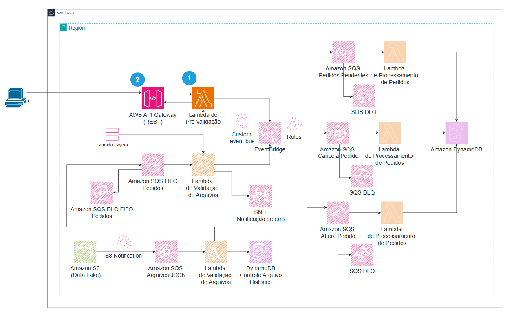

# Terceira Parte: Entrada de Pedidos via API Gateway
Esta etapa ensinará como configurar um API Gateway para receber pedidos via requisições HTTP e como processá-los usando uma Lambda, com validação e envio para o EventBridge. Será reutilizada a layer de validação criada na segunda parte para garantir consistência.

---



## **O que Você Irá Aprender nesta atividade**

- [**Etapa 1:** Criar a Função Lambda](#etapa-1-criar-a-função-lambda).
- [**Etapa 2:** Criar o API Gateway](#etapa-2-criar-o-api-gateway)
- [**Etapa 3:** Teste Manual no Console (Api Gateway).](#etapa-3-teste-manual-no-console-api-gateway)

## Etapa 1: Criar a Função Lambda

### 1.1. Acessar o AWS Lambda
1. No menu de serviços da AWS, procure por **Lambda**.
2. Clique em **Create function**.

### 1.2. Criar a Função
1. **Function name:** `validation-and-send-api-lambda`
2. **Runtime:** escolha **Python 3.13** (ou versão mais recente disponível).
3. Clique em **Create function**.


### 1.3. Código da Lambda
Na página da função, role até **Code source**:

1. Apague o conteúdo padrão do editor.
2. Cole o seguinte código:
```python
import json
import boto3
import os
import logging
from order_validation_layer import validate_order

logger = logging.getLogger()
logger.setLevel(logging.INFO)

eventbridge_client = boto3.client('events')

EVENT_BUS_NAME = os.getenv('EVENT_BUS_NAME')

def lambda_handler(event, context):
    try:
        body = json.loads(event.get('body', '{}'))
        logger.info(f"Recebendo pedido via API: {body.get('order_id', 'sem-id')}")

        if validate_order(body):
            logger.info(f"Pedido válido: {body['order_id']}")
            send_to_eventbridge(body)
            return {
                "statusCode": 200,
                "body": json.dumps({"message": "Pedido processado com sucesso"})
            }
        else:
            return {
                "statusCode": 400,
                "body": json.dumps({"error": "Pedido inválido. Verifique os campos obrigatórios."})
            }

    except Exception as e:
        logger.error(f"Erro: {str(e)}", exc_info=True)
        return {
            "statusCode": 500,
            "body": json.dumps({"error": "Erro interno no servidor"})
        }

def send_to_eventbridge(order):
    event = {
        "Source": "socket-entregas.api",
        "DetailType": "OrderEvent",
        "Detail": json.dumps(order),
        "EventBusName": EVENT_BUS_NAME
    }
    eventbridge_client.put_events(Entries=[event])
```

### 1.4. Adicionar Variáveis de Ambiente
1. Vá em **Configuration** > **Environment variables**.
2. Clique em **Edit** e depois em **Add environment variable**:
   - **Key:** `EVENT_BUS_NAME`
   - **Value:** `event-bus-pedidos`.
3. Clique em **Save**.

### 1.5. Configurar Layer
1. Na aba **Code**, vá até a seção **Layers**.
2. Clique em **Add layer**.
3. Selecione **Custom layers**
4. Selecione **order-validation-layer**
5. Version **1** ou a mais recente
6. Clique em **Add**.

### 1.6. Permissões IAM

1. Acesse **Configuration** > **Permissions**.
2. Clique na role associada à Lambda (algo como `validation-and-send-api-lambda-role-xyz`), abrindo o console do IAM..
3. Na página da role IAM, clique novamente em **Add permissions**.
4. Escolha **Create inline policy**.
5. Selecione a aba **JSON** e cole o seguinte código
     
```json
{
  "Version": "2012-10-17",
  "Statement": [
    {
      "Effect": "Allow",
      "Action": "events:PutEvents",
      "Resource": "arn:aws:events:YOUR_REGION:YOUR_ACCOUNT_ID:event-bus/event-bus-pedidos"
    }
  ]
}
```
*(ajuste Região, Conta e nome do Event Bus.)*

6. Clique em **Next**.
7. Em **Policy name** digite `LambdaEventBridgePolicy`
8. Clique em **Create policy**.


## **Etapa 2: Criar o API Gateway**

### **2.1. Criar API REST**

1. No menu de serviços, selecione **API Gateway**.
2. Clique em **Create API**.
3. Escolha **REST API** e clique em **Build**.
4. Preencha os seguintes campos:
   - **API details:** selecione `New API` 
   - **API Name:** digite `api-pedidos`
   - **Description:** digite `API para receber pedidos JSON`
   - **Endpoint Type:** `Regional`
5. Clique em **Create API**.

---

### **2.2. Criar o Recurso**

1. No painel do **API Gateway**, clique em **Create Resource**.
2. Preencha:
   - **Resource Name:** `pedido`
   - **Resource Path:** `/`
3. Clique em **Create Resource**.

### **2.3. Criar o Método**

1. Selecione o recurso `/pedido`.
2. Clique em **Create Method**.
3. Em **Method type** Escolha **POST**.
4. Configure:
   - **Integration Type:** Lambda Function.
   - **Lambda Function:** `validation-and-send-api-lambda`
5. Clique em **Create method**.

---

### **2.4. Configurar CORS (Cross-Origin Resource Sharing)**

1. Selecione o recurso **/pedido**.
2. Clique em **Enable CORS**.
3. Selecione:
   - Default 4XX
   - Default 5XX
   - Post
4. Clique em **Save**.

---

## **2.5. Deploy da API**

1. Clique em **Deploy API**.
2. Selecione **[New Stage]**.
3. Preencha os seguintes campos:
   - **Stage Name:** `prod`
   - **Deployment description:** `Versão de produção`
4. Clique em **Deploy**.

---

## **Etapa 3: Teste Manual no Console (Api Gateway e Lambda)**

### **3.1. Realizar um Teste direto no API GATEWAY**

1. Na console do AWS API Gateway, no menu lateral, clique Resource
2. Clique no Método **POST**.
3. Clique na ABA **Test**
4. Em **Test method** preencha os campos:
   - **Query strings:** deixe vazio, pois não estamos utilizando parâmetros na URL.
   - **Headers:** `application/json`
   - **Request Body:**

	```json
	{
	  "order_id": "TS-00123",
	  "company": {
	    "name": "Tech Solutions Ltda",
	    "cnpj": "12.345.678/0001-99"
	  },
	  "items": [
	    {
	      "product_id": "TS-001",
	      "description": "Smartphone XYZ",
	      "quantity": 1,
	      "unit_price": 2500.00
	    }
 	  ],
	  "order_status": "Pendente"
	}
	```

### **3.2. Teste para Lambda no Console AWS

Para testar sua Lambda diretamente pelo console AWS, copie o JSON de teste abaixo e insira na aba **Test** da função Lambda.

## **Passos para Teste**
1. No console AWS, acesse sua função Lambda.
2. Clique em **Test** na parte superior direita.
3. Clique em **Configure test event**.
4. Escolha **Create new test event**.
5. Nomeie o evento como `TestePedido`.
6. Cole o JSON de teste fornecido no campo de conteúdo.
~~~json
{
  "body": "{\"order_id\": \"12345\", \"customer\": { \"name\": \"João Silva\" }, \"items\": [{ \"product_id\": \"001\", \"quantity\": 2 }], \"payment\": { \"method\": \"credit_card\", \"status\": \"paid\" }, \"company\": { \"name\": \"Acme Corp\" }, \"order_status\": \"Pendente\" }"
}
~~~
8. Clique em **Save**.
9. Clique em **Test**.

## **Resultados Esperados**
- **200 OK**: Pedido processado com sucesso.
- **400 Bad Request**: Retorna "Pedido inválido. Verifique os campos obrigatórios." se algum campo estiver ausente ou inválido.

Se o retorno ainda indicar erro, verifique os logs no **CloudWatch** para capturar detalhes dos campos faltantes.


### **3.3. Verificação da Fila SQS**

1. Acesse a fila `order-processing.fifo`.
2. Verifique se a mensagem foi recebida na aba **Messages available**.
3. Acesse a fila `order-processing-dlq.fifo` e verifique se há mensagens com erro.

---

## **3.4. Monitoramento e Logs**

1. Acesse o console **CloudWatch**.
2. Verifique os logs gerados pela função Lambda.
3. Analise se há falhas ou exceções.

---

### **Conclusão**
Com isso, a arquitetura está completa:
- O **API Gateway** permite entrada de pedidos via HTTP.
- O **EventBridge** roteia os pedidos para filas SQS específicas.
- As funções Lambda tratam cada tipo de operação com DynamoDB.


