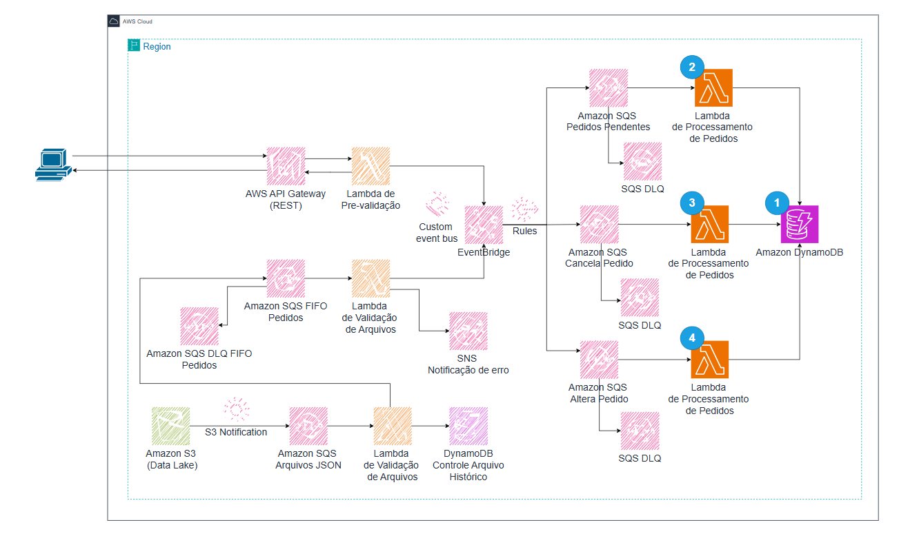

# Laboratório Serverless AWS: Parte 4 - Backend com Operações de Pedidos

Nesta etapa final, vamos construir um backend que processa pedidos nas filas SQS geradas pelo EventBridge. Os pedidos serão armazenados em uma estrutura **Single Table Design** no DynamoDB. Três funções Lambda serão implementadas para **armazenar, alterar e cancelar** pedidos.

---

## **Estrutura da Tabela DynamoDB**

A tabela será estruturada da seguinte forma:

| **PK**                          | **SK**                  | **GSI2#PK**               | **GSI2#SK**                                         |
|----------------------------------|-------------------------|--------------------------|---------------------------------------------------|
| COMPANY#<cnpj>#ORDER#<order_id>  | STATUS#<order_status>   |                          |                                                   |
|                                  | ITEM#<product_id>       | ITEMSTATUS#<item_status> | COMPANY#<cnpj>#ORDER#<order_id>#ITEM#<product_id> |
|                                  | CUSTOMER#<cpf>          |                          |                                                   |
|                                  | META#<cnpj>             |                          |                                                   |
|                                  | SHIPPING#<city>#<date>  |                          |                                                   |
|                                  | PAYMENT#<payment_method>|                          |                                                   |

Além do índice secundário `GSI2`, será criado um **novo índice GSI3** que inverte a **PK** e a **SK**:
- **Partition Key:** `SK`
- **Sort Key:** `PK`

Esse índice permite realizar consultas rápidas utilizando os atributos secundários como principais.

---

## **1. Criar a Tabela DynamoDB**

1. No console da AWS, acesse **DynamoDB** e clique em **Create Table**.
2. **Table name:** `OrdersTable`.
3. **Partition Key (PK):** `PK` (Tipo: String).
4. **Sort Key (SK):** `SK` (Tipo: String).
5. Clique em **Create Table**.

Adicione os índices secundários globais:
- **GSI2:**
  - **Partition Key:** `GSI2#PK` (String)
  - **Sort Key:** `GSI2#SK` (String).
- **GSI3:**
  - **Partition Key:** `SK` (String)
  - **Sort Key:** `PK` (String).

---

## **2. Criar as Filas SQS**

1. No console da AWS, acesse **SQS** e crie as seguintes filas FIFO:
   - `pedidos-novos.fifo`
   - `alterar-pedidos.fifo`
   - `cancelar-pedidos.fifo`

2. Crie uma **Dead Letter Queue (DLQ)** para cada fila.

---

## **3. Criar Funções Lambda**

### **3.1 Função Lambda: Armazenar Pedido**

**Function name:** `store-order-lambda`

**Código:**
~~~python
import boto3
import json
import os
from datetime import datetime

dynamo_client = boto3.resource('dynamodb')
TABLE_NAME = os.getenv('DYNAMO_TABLE_NAME')

def lambda_handler(event, context):
    for record in event['Records']:
        body = json.loads(record['body'])
        order_id = body['order_id']
        pk = f"COMPANY#{body['company']['cnpj']}#ORDER#{order_id}"
        sk = "STATUS#Pendente"
        table = dynamo_client.Table(TABLE_NAME)

        # Verifica se o pedido já existe
        response = table.get_item(Key={"PK": pk, "SK": sk})
        if 'Item' in response:
            return {
                'statusCode': 400,
                'body': json.dumps({'error': 'Pedido já existe'})
            }

        # Insere o pedido na tabela
        table.put_item(
            Item={
                "PK": pk,
                "SK": sk,
                "data": body,
                "created_at": datetime.utcnow().isoformat()
            }
        )
        return {
            'statusCode': 200,
            'body': json.dumps({'message': 'Pedido armazenado com sucesso'})
        }
~~~

### **3.2 Função Lambda: Alterar Pedido**

**Function name:** `update-order-lambda`

**Código:**
~~~python
import boto3
import json
import os

dynamo_client = boto3.resource('dynamodb')
TABLE_NAME = os.getenv('DYNAMO_TABLE_NAME')

def lambda_handler(event, context):
    for record in event['Records']:
        body = json.loads(record['body'])
        order_id = body['order_id']
        new_status = body.get('order_status', 'Indefinido')
        pk = f"COMPANY#{body['company']['cnpj']}#ORDER#{order_id}"
        sk = "STATUS#Pendente"
        table = dynamo_client.Table(TABLE_NAME)

        # Verifica se o pedido existe
        response = table.get_item(Key={"PK": pk, "SK": sk})
        if 'Item' not in response:
            return {
                'statusCode': 404,
                'body': json.dumps({'error': 'Pedido não encontrado'})
            }

        # Atualiza o status do pedido
        table.update_item(
            Key={"PK": pk, "SK": sk},
            UpdateExpression="SET #status = :s",
            ExpressionAttributeNames={"#status": "order_status"},
            ExpressionAttributeValues={":s": new_status}
        )
        return {
            'statusCode': 200,
            'body': json.dumps({'message': 'Pedido atualizado com sucesso'})
        }
~~~

### **3.3 Função Lambda: Cancelar Pedido**

**Function name:** `cancel-order-lambda`

**Código:**
~~~python
import boto3
import json
import os

dynamo_client = boto3.resource('dynamodb')
TABLE_NAME = os.getenv('DYNAMO_TABLE_NAME')

def lambda_handler(event, context):
    for record in event['Records']:
        body = json.loads(record['body'])
        order_id = body['order_id']
        pk = f"COMPANY#{body['company']['cnpj']}#ORDER#{order_id}"
        sk = "STATUS#Pendente"
        table = dynamo_client.Table(TABLE_NAME)

        # Verifica se o pedido existe
        response = table.get_item(Key={"PK": pk, "SK": sk})
        if 'Item' not in response:
            return {
                'statusCode': 404,
                'body': json.dumps({'error': 'Pedido não encontrado'})
            }

        # Remove o pedido
        table.delete_item(Key={"PK": pk, "SK": sk})
        return {
            'statusCode': 200,
            'body': json.dumps({'message': 'Pedido cancelado com sucesso'})
        }
~~~

---

## **4. Configuração do EventBridge e Integração**

1. Crie regras no **EventBridge** para enviar eventos para as filas SQS correspondentes:
   - **Regras:**
     - `PedidosNovos`: Envia eventos de pedidos novos para `pedidos-novos.fifo`.
     - `AlterarPedidos`: Envia eventos de alteração para `alterar-pedidos.fifo`.
     - `CancelarPedidos`: Envia eventos de cancelamento para `cancelar-pedidos.fifo`.

2. As funções Lambda serão configuradas como consumidores das filas SQS.

---

## **5. Consultas no DynamoDB**

### **Consulta 1: Buscar Pedido por CNPJ e Order ID**
~~~
SELECT * FROM OrdersTable WHERE PK = 'COMPANY#12.345.678/0001-99#ORDER#12345' AND SK = 'STATUS#Pendente'
~~~

### **Consulta 2: Buscar Itens do Pedido**
~~~
SELECT * FROM OrdersTable WHERE GSI2#PK = 'ITEMSTATUS#Disponível' AND GSI2#SK = 'COMPANY#12.345.678/0001-99#ORDER#12345#ITEM#001'
~~~

### **Consulta 3: Buscar por CPF do Cliente**
~~~
SELECT * FROM OrdersTable WHERE PK = 'COMPANY#12.345.678/0001-99#ORDER#12345' AND SK = 'CUSTOMER#123.456.789-10'
~~~

### **Consulta 4: Busca usando GSI3 (Status como Chave Primária)**
~~~
SELECT * FROM OrdersTable WHERE SK = 'STATUS#Cancelado'
~~~

---

## **6. Teste Completo**

1. Enviar mensagens de teste para cada fila SQS.
2. Validar as operações no **DynamoDB**.
3. Verificar logs no **CloudWatch**.

---

## **Conclusão**

Com esta última parte, a arquitetura de pedidos foi implementada com sucesso utilizando **EventBridge**, **SQS**, **DynamoDB** e **Lambda Functions**. A solução permite gerenciar todo o ciclo de vida de um pedido de forma escalável e eficiente.

